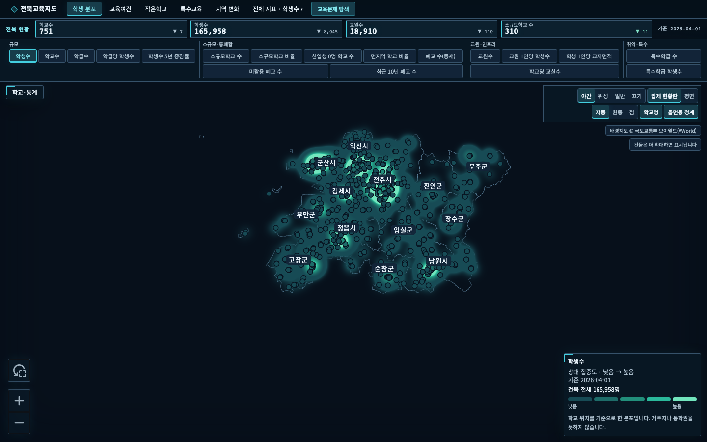
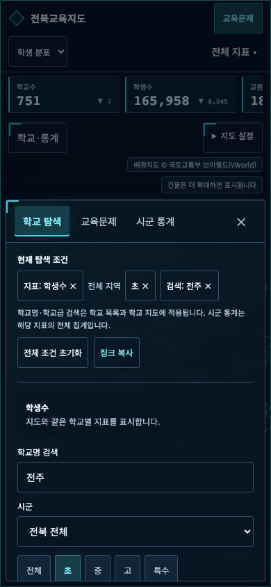

# 전북교육지도

[](https://github.com/taehyeonglim/jb-edu-map/actions/workflows/ci.yml)
[](LICENSE)

전북특별자치도의 학교와 교육 현황을 지도에서 살펴보고, 두 시군을 비교해 자료로 저장하는 오픈소스 대시보드입니다. 교사·교육행정 담당자의 현황 파악과 회의·보고 자료 활용을 돕습니다. 지역 profile을 바꾸면 다른 시도로 확장할 수 있습니다.

**[서비스 열기](https://jb-edu-map.vercel.app)** · [변경 기록](CHANGELOG.md) · [운영 안내](docs/OPERATIONS.md) · [기여 안내](CONTRIBUTING.md)

> 아래는 저장소의 현재 구현 안내입니다. 서비스에 반영된 범위는 변경 기록의 릴리스 상태를 확인하세요.





## 무엇을 할 수 있나요?

| 작업 | 사용 방법 |
| --- | --- |
| 학교 찾기 | `학교·통계 → 학교 탐색`에서 학교명·시군·학교급 검색. 학교를 누르면 지도 위 상세정보 표시 |
| 두 시군 비교 | `시군 통계`에서 기준 지역과 비교 지역 선택. 18개 지표의 최신 값·차이·기준일과 선택 지표의 두 지역 추이 확인 |
| 교육문제 탐색 | `교육문제`에서 작은학교, 지역 변화, 특수교육, 폐교 활용 등 10개 질문 탐색 |
| 조건 공유 | 패널의 `링크 복사`. 학교명·학교급·지역·지표·비교 지역을 새 창에서도 복원 |
| 자료 저장 | `검색 결과 CSV 저장` 또는 `비교표 CSV 저장`. 기준일·출처·적용 조건을 함께 저장 |

어두운 테마의 입체 지도가 기본입니다. 상단 주제 메뉴는 자주 보는 주제로 이동하고, 데스크톱 지표 바로가기와 모바일 `전체 지표` 메뉴는 모든 지표를 제공합니다. 지도 설정에서 평면·입체, 자동 표현·원통·점 등을 바꿀 수 있습니다.

지표를 누르면 데스크톱에서는 분석 패널이 열리고 모바일에서는 기준일과 전체 값을 담은 요약 카드에서 `분석 펼치기`로 이어집니다. 시군별 막대, 학교별 값 분포, 학교급 구성과 일반학교·특수학교 비교를 지표에 맞게 표시합니다. 교육문제는 학교 규모 구성, 특수교육 추이, 교사 배치율, 기관 자료의 수록 범위 등 질문에 맞는 차트를 먼저 보여줍니다. 통계·교육문제 화면의 공유 기능은 `탐색 조건`을 펼쳐 사용합니다.

지도 범례는 실제 점·원통·밀도 표현에 맞춰 바뀌며 색 구간은 지역을 바꿔도 같은 기준을 사용합니다. 시군 집계 지표의 학교 위치는 `학교 위치 보기`로 별도 표시합니다. 학교별 값이 없는 시군 지표를 학교의 수치로 해석하지 않도록 구분합니다.

학교 목록은 50개씩 추가 표시하지만 지도와 CSV에는 검색 결과 전체를 사용합니다. 학교명·학교급 검색은 학교 목록과 학교 지도에 적용되며 시군 통계는 해당 지표의 전체 집계입니다. WebGL을 사용할 수 없거나 지도에 오류가 생기면 학교 상세를 포함한 표 화면을 제공합니다.

비교표의 차이는 **기준 지역 − 비교 지역**입니다. 비율 차이는 `%p`로 표시하고 결측값은 계산하지 않습니다. 추이가 있는 지표는 같은 축에서 두 지역을 비교하며 빈 연도를 연결하거나 한 해의 자료로 추이를 만들지 않습니다. 비교표는 지표별 최신 값이고 차트의 연도 선택이 지도 전체 기준연도를 바꾸지는 않습니다.

시계열은 단위·세로축 눈금과 연도별 전체 수치를 제공합니다. 세로축이 0에서 시작하지 않으면 `세로축 확대`를 표시합니다. 학생수 증감률에서는 변화의 근거가 되는 학생수 추이를 함께 표시합니다.

CSV는 UTF-8 BOM 형식으로 한글 Excel 열기를 지원합니다. 결측값은 빈 값과 자료 상태로 구분하고 문자형 수식의 실행을 방지합니다. 공유 링크는 탐색 조건을 복원하며 카메라 위치·스크롤·차트에서 선택한 연도는 저장하지 않습니다.

## 빠른 시작

Node.js **22.x**, npm **10 이상**이 필요합니다.

```bash
git clone https://github.com/taehyeonglim/jb-edu-map.git
cd jb-edu-map
nvm use
npm ci
npm run dev
```

[로컬 화면 열기](http://localhost:3000). 저장소에 포함된 `public/data/`만으로 학교·경계·통계 탐색이 동작합니다. 원천 파일 다운로드나 데이터 재생성은 처음 실행할 때 필요하지 않습니다.

배경지도와 근접 건물은 선택 기능입니다.

```bash
cp .env.example .env.local
```

- `NEXT_PUBLIC_VWORLD_KEY`: 브라우저 배경지도 키. 없으면 경계·학교·통계를 표시합니다.
- `VWORLD_BUILDING_KEY`, `VWORLD_BUILDING_DOMAIN`: 서버의 건물 조회 키와 등록 도메인.
- `NEXT_PUBLIC_SITE_URL`: 배포 시 실제 공개 주소. 예시 파일의 localhost를 배포 주소로 변경합니다.
- `NEXT_PUBLIC_EDU_MAP_PROFILE`: 지역 profile, 기본 `jeonbuk`.

건물 활성화·지도 효과 등 전체 설정과 Vercel 배포 방법은 [운영 안내](docs/OPERATIONS.md)에 있습니다. 공개 환경변수는 빌드 시 반영되므로 변경 후 재빌드합니다. 실제 키를 커밋하지 마세요.

## 개발과 검증

Next.js App Router, React, TypeScript, deck.gl, nuqs를 사용합니다. 정확한 의존성 버전은 [package.json](package.json)과 lockfile을 기준으로 합니다.

| 명령 | 용도 |
| --- | --- |
| `npm run dev` | 개발 서버 |
| `npm run build` / `npm start` | 프로덕션 빌드 / 실행 |
| `npm run typecheck` / `npm run lint` | 타입 / 코드 검사 |
| `npm test` / `npm run test:watch` | 단위·컴포넌트 테스트 |
| `npx playwright install chromium` | E2E 브라우저 설치 |
| `npm run e2e -- --workers=1` | 외부 지도 API를 대체한 기본 브라우저 검증 |
| `npm run docs:check` | 주요 문서의 로컬 링크·이미지 검사 |
| `npm run data:validate` | 생성 데이터 검증 |
| `npm run data:build` | 원천 자료로 전체 데이터 재생성 |
| `npm run data:issues` | 교육문제 자료 생성 |
| `npm run social:build` | 공유 썸네일·아이콘 생성 |
| `npm run perf:measure` | 실행 중인 개발 서버의 탐색 성능 측정 |

GitHub Actions는 push·PR마다 문서·데이터·타입·lint·단위 테스트·빌드와 기본 E2E를 검사합니다. 실제 건물 API와 배포 주소는 **External verification** 수동 워크플로로 검증합니다. 실행 조건과 제한은 [운영 안내](docs/OPERATIONS.md), 검증 결과는 [업그레이드 검증 기록](docs/UPGRADE_VALIDATION.md)과 [전체 검수 기록](docs/FULL_REVIEW.md)을 참고하세요.

## 데이터와 해석

- **KESS 교육기본통계**: 한국교육개발원 교육통계서비스의 학교별 학생·학급·교원 등 통계. 지표별 기준일은 화면과 CSV에 표시합니다.
- **한국교육시설안전원 초중등학교위치 표준데이터**: 학교 위치의 기본 출처. 특수학교 위치는 공식 안내로 보완하며 출처·확인일을 표시합니다. 좌표 없는 학교도 목록과 집계에 남깁니다.
- **전북특별자치도교육청 폐교재산 현황**: 수록된 폐교재산과 활용 상태. 모든 폐교의 역사 전체를 뜻하지 않습니다.
- **[vuski/admdongkor](https://github.com/vuski/admdongkor)**: 통계청 SGIS 기반 경계, CC BY 4.0. 이 프로젝트는 경계를 단순화·가공하여 시군·인접 지역·읍면동 GeoJSON으로 배포하고 앱에도 출처를 표시합니다.
- **VWorld 오픈API**: 배경지도와 근접 건물. 지도에 출처를 표시합니다.
- **교육문제 자료**: 행정안전부 지정 현황, 전북교육청 공식 기관·사업 명단, 지역아동센터 자료 등. [교육 자원 안내](docs/ISSUE_RESOURCES.md)에 범위와 기준일을 기록합니다.

공식 인구감소지역 지정은 미래 소멸 예측이 아닙니다. 소규모학교 기준은 앱의 탐색 기준이며 통폐합 예정·정책 효과·서비스 충분성을 수치만으로 판정하지 않습니다. 결측값과 0을 구분하고 정책 문서 발행일, 통계 기준일, 공식 자료 확인일을 구별합니다.

원자료와 생성 데이터에는 각 출처의 이용 조건이 적용됩니다. 원천 파일은 저장소에 포함하지 않습니다. 소스 코드는 [MIT 라이선스](LICENSE)입니다. 원천 `.xlsx` 파서는 데이터 파이프라인 전용이며 브라우저 코드와 분리되어 있습니다.

## 다른 지역과 후속 개발

```bash
npm run data:build -- --profile=<지역ID>
NEXT_PUBLIC_EDU_MAP_PROFILE=<지역ID> npm run dev
```

새 지역의 profile 등록·원천 입력·출처·보정 규칙은 [지역 profile 안내](docs/REGION_PROFILE.md)를 따릅니다. 상세 표현 원칙은 [교육현황 지도](docs/education-city/README.md), [학교 차트](docs/school-chart/README.md), [건물 지도](docs/city-buildings/README.md)에 있습니다.

학교 비교·관심 목록, 지도 전체 연도 전환, 새 지역·지표는 [후속 로드맵](docs/ROADMAP.md)의 후보입니다. 다문화(이주배경) 학생 지표는 시군 단위 공개 자료 확보가 필요해 현재 포함하지 않습니다.
